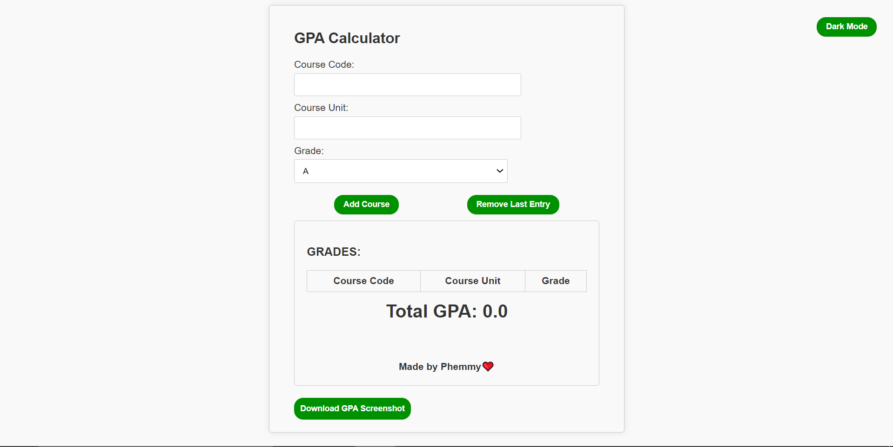

# GPA Calculator

This is a web-based GPA calculator that allows users to calculate their GPA for a semester and optionally save their results as an image. It also features the ability to add and remove courses, a light and dark mode, and a history-clearing button.

## Table of Contents
- [Features](#features)
- [Demo](#demo)
- [Screenshots](#screenshots)
- [Usage](#usage)
- [Clear History](#clear-history)
- [Light and Dark Mode](#light-and-dark-mode)

## Features

- Calculate GPA for a semester based on course codes, course units, and grades.
- Add and remove courses from the calculation.
- Option to download GPA results as an image for reference.
- Toggle between light mode and dark mode for a personalized experience.
- Save and load calculation history from browser storage.
- Clear history to start fresh.

## Demo

You can try the GPA Calculator here: [Demo](https://gpa-calculator1.netlify.app/)

## Screenshots

## Usage

1. Enter your course code, course unit, and grade.
2. Click the "Add Grade" button to add the course to the calculation.
3. Repeat the above steps for each course.
4. Your GPA will be displayed in the "Total GPA" section.
5. Optionally, click the "Download Screenshot" button to save your GPA results as an image.

## Clear History

To clear your calculation history:

1. Click the "Clear History" button.
2. This action will remove all saved calculation history from your browser.

## Light and Dark Mode

- Click the different modes button to switch between light mode and dark mode.
- In light mode, the background is light, and the text is dark.
- In dark mode, the background is dark, and the text is light.

