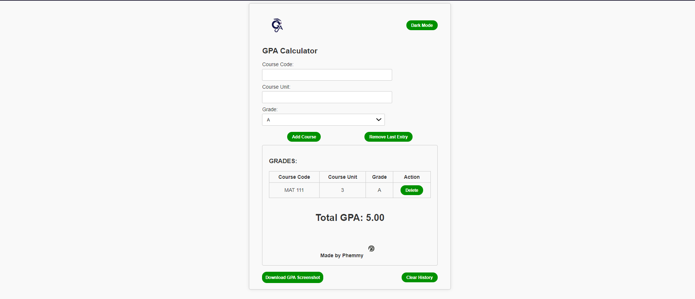

# GPA Calculator

This is a simple web-based GPA calculator that allows users to calculate their GPA for a semester and optionally save their results as an image. It also has a feature for light and dark mode.

## Table of Contents
- [Features](#features)
- [Demo](#demo)
- [Screenshots](#screenshots)
- [Light and Dark Mode](#light-and-dark-mode)

## Features

- Calculate GPA for a semester based on course codes, course units, and grades.
- Add and remove courses from the calculation.
- Option to download GPA results as an image for reference.
- Toggle between light mode and dark mode for a personalized experience.

## Demo

You can try the GPA Calculator here: [Demo](#) (Replace with your demo link if available)

## Screenshots

## Light and Dark Mode
Click the "Toggle Mode" button to switch between light mode and dark mode.
In light mode, the background is light, and the text is dark.
In dark mode, the background is dark, and the text is light.

